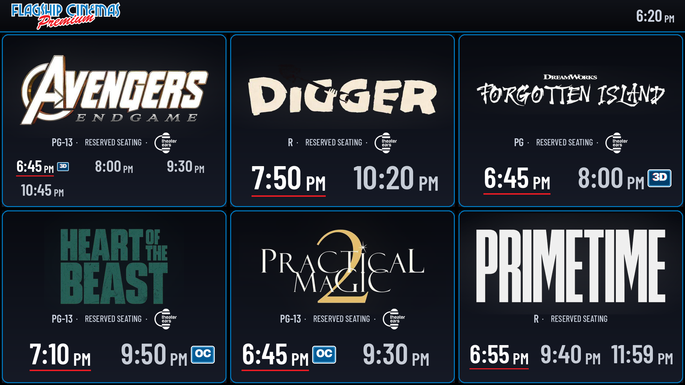
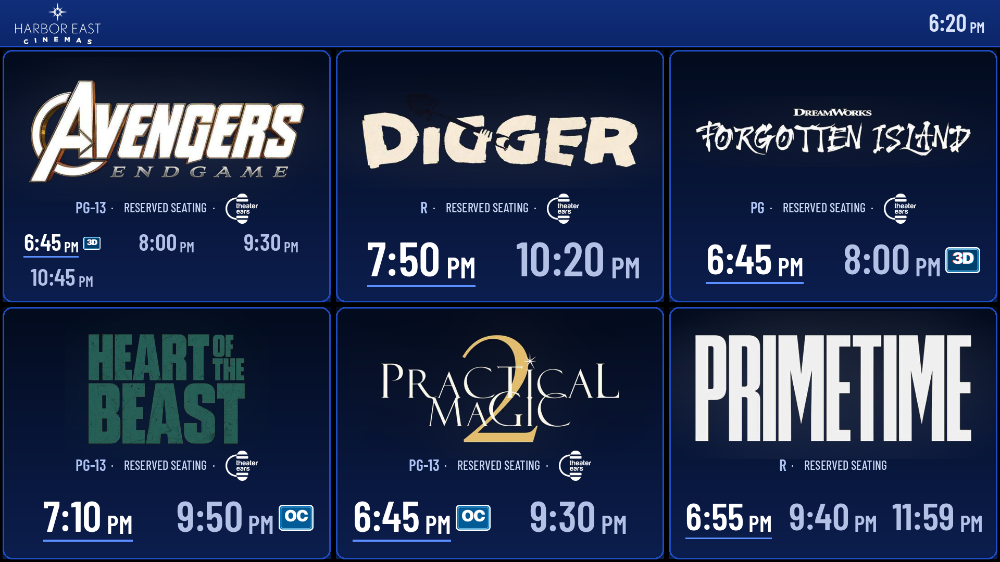
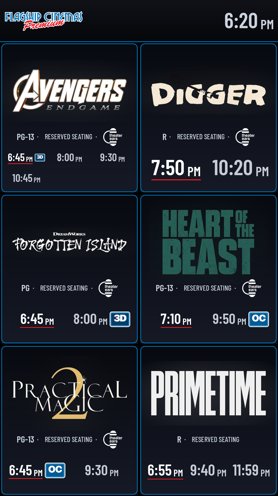
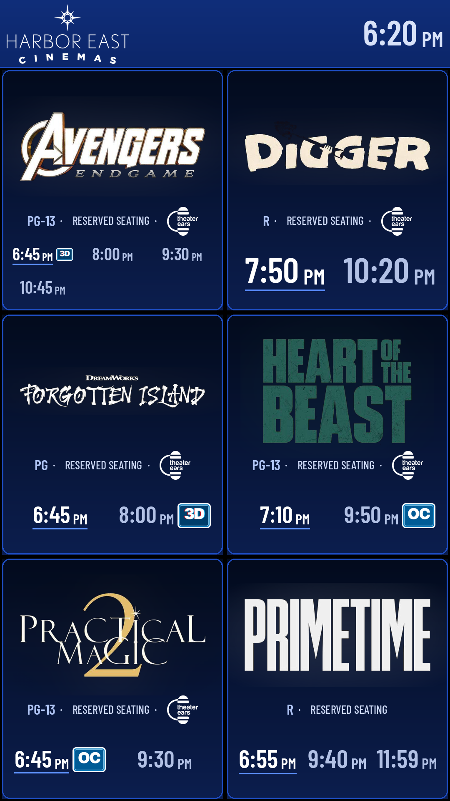

# INDY Bload v2

Lobby showtimes board for [info-beamer](https://info-beamer.com) Raspberry Pi players,
fed live from the Indy GraphQL API (with the legacy BLOAD.txt-over-FTP mode as a fallback).

v2 is a visual and functional overhaul of the original BLOAD player package:
title-art cards, legible condensed showtimes, per-brand theming, and badge art
for 3D / Open Caption / Sensory Friendly shows.

| Harbor East, landscape | Flagship, portrait | Harbor East, portrait |
|---|---|---|
|  |  |  |

## What's new in v2

- **Brands** – *Flagship Cinemas* (Flagship blue + red, silver text) or
  *Harbor East Cinemas* (navy + royal blue, from harboreastcinemas.com),
  with a slim header strip showing the brand logo and current time.
- **Board styles** – Premium (default: rounded brand frame, subtle halo behind
  the title art), Refined (white rating bar), Minimal.
- **Showtimes** in Barlow Condensed, one size per card, smaller AM/PM, an
  underline on the next showing, past showings dimmed and struck through.
- **Badges** next to showtimes: 3D, Open Caption (OC) and Sensory Friendly (SF),
  each replaceable from the setup. Theater Ears is shown as its logo.
- **Tall cards** – a movie with more than *N* showtimes spans two rows so its
  times stay large (see `docs/previews/tall-*.png`).
- **Portrait** uses a 2×3 grid for 5–6 movies (no empty bottom row).
- Fixes: `bload_age` no-globals error on every Indy update; movie images now
  match by name with any extension (not just `.jpg`).

## Setup options (node.json)

| Setting | Default | Notes |
|---|---|---|
| Indy site ID | 338 | Theater-wide showings list ID |
| Movies per page / Page interval | 4 / 5 s | Paging through the day's movies |
| Hide past showings | off | Recommended **on** for lobby use |
| Brand | Flagship Cinemas | or Harbor East Cinemas |
| Show brand header | on | Logo + clock strip across the top |
| Harbor East logo | `harbor-east.png` | Flagship uses the *Logo* setting |
| Tall card above N showtimes | 8 | 0 turns tall cards off |
| Board style | Premium | Premium / Refined / Minimal |
| Show Reserved Seating | on | Hide the Reserved Seating feature text |
| Theater Ears logo | `theater-ears.png` | Replaces the words "Theater Ears" |
| 3D / Open Caption / Sensory Friendly badge | `badge-3d.png` / `open-caption.png` / `badge-sf.png` | Falls back to a drawn tag if missing |
| Movie images | – | Title art, matched to movies by file name (e.g. `digger.jpg`) |

Title art: JPG or PNG on a black background works best; the Premium and
Minimal styles key the black out so logos float on the card.

## Files

| File | Purpose |
|---|---|
| `node.lua` | Board rendering (layout, cards, styles, brands) |
| `service` | Polls Indy, writes `showings.json`; optional FTP server |
| `node.json` | info-beamer setup options |
| `times.ttf`, `label.ttf` | Barlow Condensed SemiBold / Medium (SIL OFL, see `OFL-BarlowCondensed.txt`) |
| `keyblack.glsl`, `glow.glsl`, `frame.glsl` | Logo keying, halo, rounded frame shaders |
| `grad-*.png` | Card and header gradients |
| `badge-*.png`, `open-caption.png`, `theater-ears.png` | Badge / feature art |
| `harbor-east.png`, `flagship.png` | Brand logos |

## Known open items

- Indy mode has no "schedule is stale" fallback yet (BLOAD mode does).
- Shows after midnight (e.g. 12:15 AM) sort first and are treated as started.
- `showings.json` is written non-atomically.
- Seat-availability colors only work in BLOAD mode.

## License

Based on the BLOAD player package by Florian Wesch / info-beamer; see `COPYRIGHT`.
Barlow Condensed is licensed under the SIL Open Font License 1.1.
